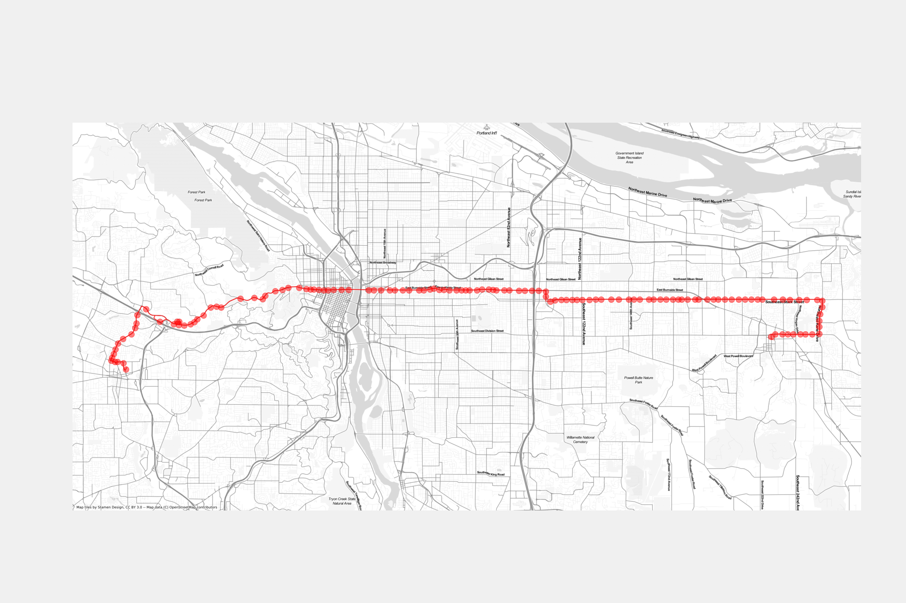
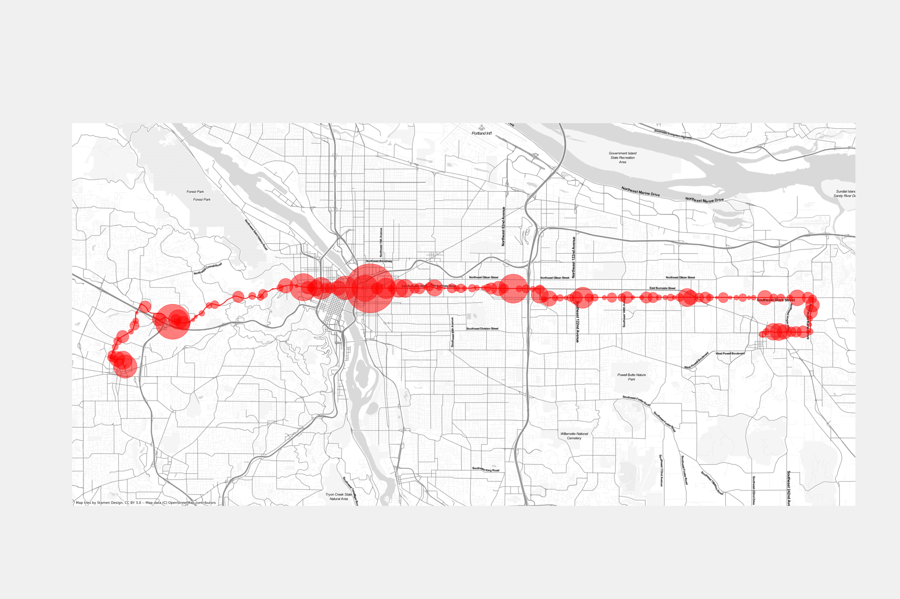

# Project to predict bus arrival times in Portland

Intro:

- motivation
- Portland

## Explorative visualisations

Rush hour traffic

1 point at 1 moment = 1 observation

Line 20

Line 20 variance

