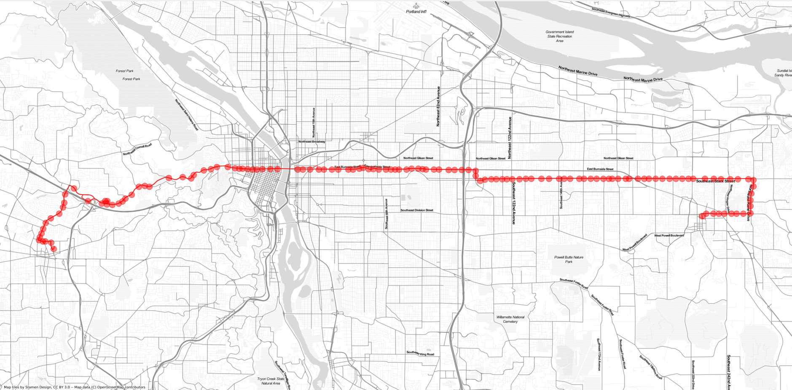
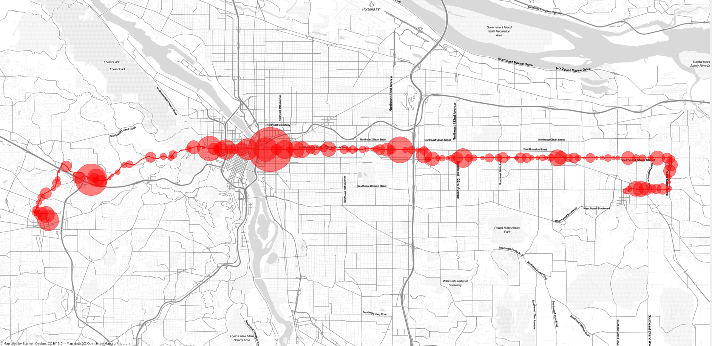
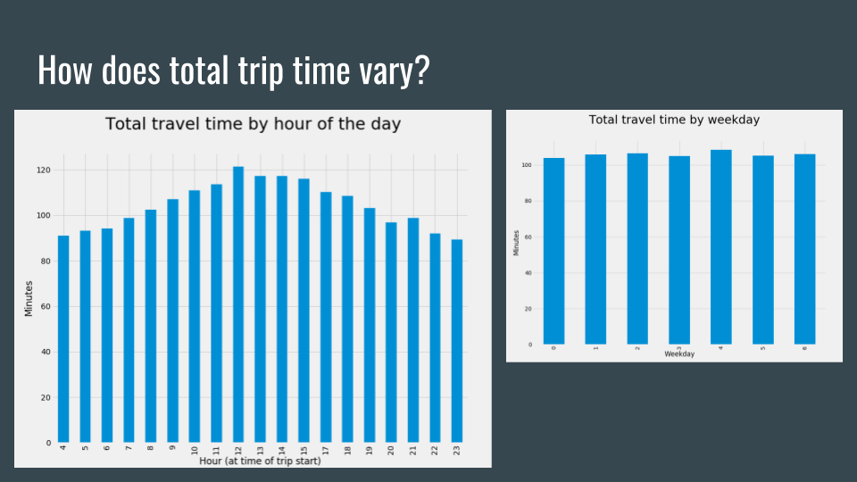
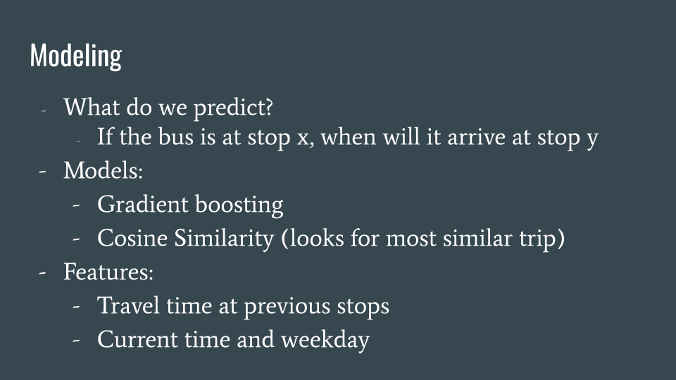
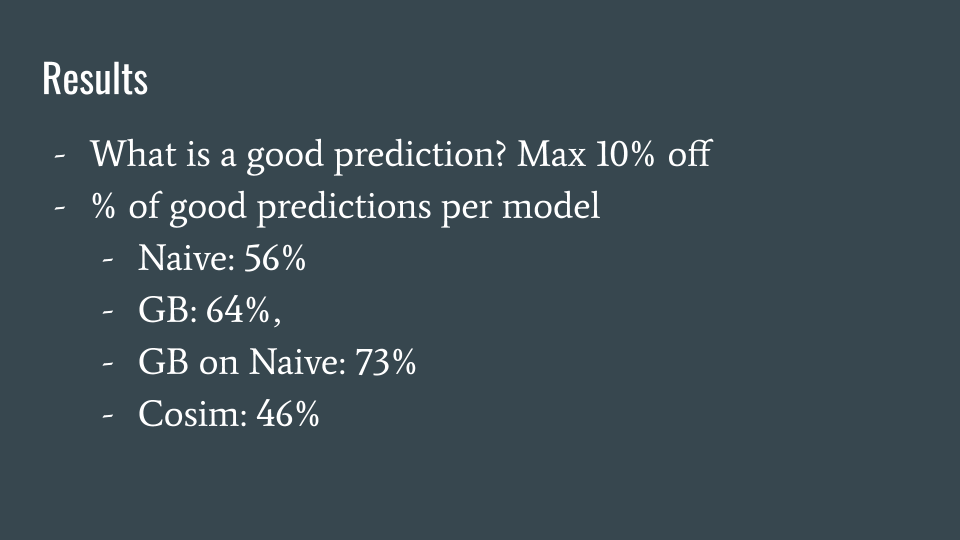
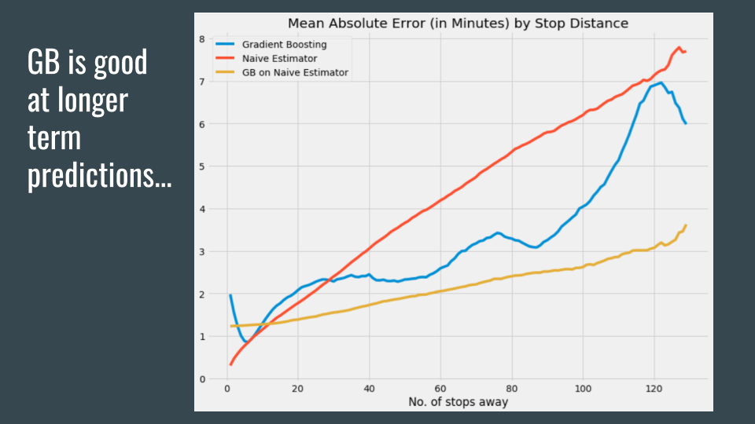
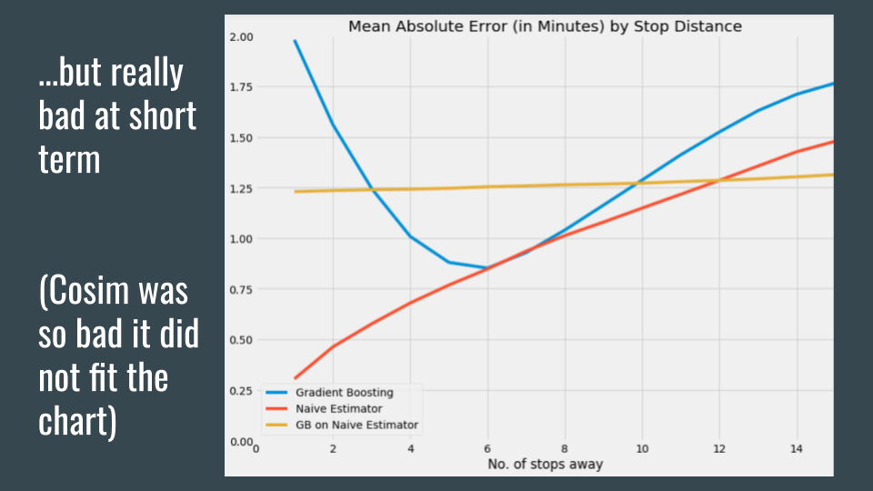

# Visualizing bus traffic and predicting bus arrival times in Portland

Intro:

- motivation
- Portland

## Data collection

- Process: 
- data format: gtfs realtime

## Explorative visualisations

### Rush hour traffic

Downtown looks quite jammed, so let's zoom in to get a better view:

### Line 20

- most important bus line in portland - traverses whole city, frequent, 24/7
- no of stops

**Variance of travel times by stop**

- stops with a high variance: sometimes bus passes quickly, sometimes it takes very long --> difficult to predict
- high variance in stops downtown (makes intuitive sense)

Line 20 variance

**Total trip time...**

...varies quite a bit during the day, but not between weekdays.

## Modeling

## Results

## Next steps / ideas for exploration

- Fine-tune model to improve short-term predictions
- Create a dashboard for real-time transit analysis
- Collect data long-term to analyze trends
- Develop a model for bus arrival times in Berlin (data structures vary)

## Tech stack

- Download: AWS EC2
- Database: PostgreSQL (on AWS RDS)
- Modeling: sklearn
- Visualisation: geopandas, geoplot, matplotlib

